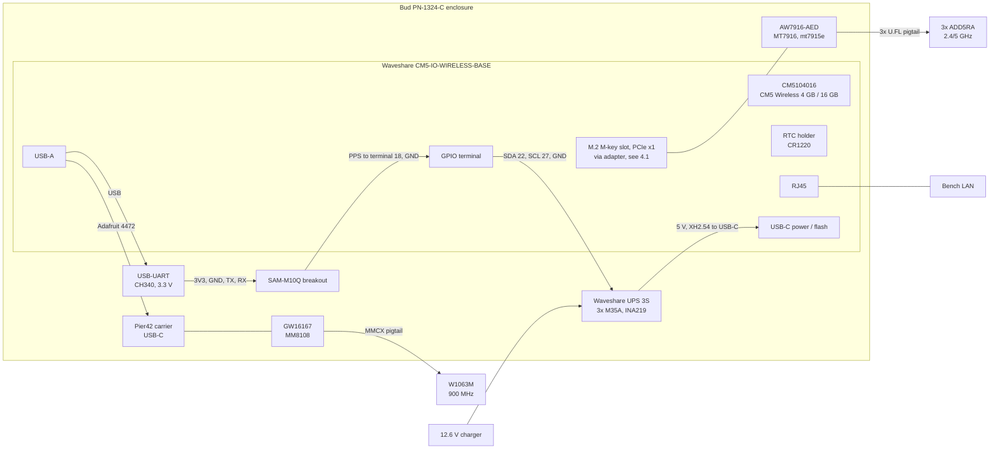

# OpenMANET POC bench BOM and topology (GHO-27)

## Expanded capability scope

The current capability contract is [Maer requirements](../requirements/maer-capabilities.md) (D-029 through D-032). This document describes the selected baseline and does not by itself demonstrate the expanded contract. GHO-50 owns POC hardware reconciliation; GHO-55 owns V1 impact and freeze disposition. 


Linear: [GHO-27 Define the POC bench BOM and topology](https://linear.app/ghostnet-labs/issue/GHO-27/define-the-poc-bench-bom-and-topology)
· Project: [OpenMANET POC](https://linear.app/ghostnet-labs/project/openmanet-poc-66239aa64a35)
· Purchase record: [OpenMANET POC — Purchase BOM](https://linear.app/ghostnet-labs/document/openmanet-poc-purchase-bom-ff58aa264535)
· Ordering and receiving: [GHO-36](https://linear.app/ghostnet-labs/issue/GHO-36/place-receive-and-inventory-the-two-node-bench-hardware-order)

Revision: 2026-10-01. Nothing below has been received or powered yet.

This document defines the off-the-shelf bench that the POC tests run on
([GHO-28](https://linear.app/ghostnet-labs/issue/GHO-28) to
[GHO-31](https://linear.app/ghostnet-labs/issue/GHO-31)). It is built from the
two-node cart verified on 2026-09-30 (decisions D-015 and D-018 in [../decisions.md](../decisions.md)).
Part selections (A-nn) are owned by [track-a.md](track-a.md). Quantities, prices
and buy links live only in the Linear purchase BOM. This file owns the bench
configuration, wiring, firmware revision, safety rules and arrival checks.

## 1. Bench parts vs. the V1 carrier

The bench deliberately does **not** use the V1 radio set. Results from it are
evidence for the architecture, not validation of the V1 parts.

| Function | POC bench part | V1 carrier part ([BOM Baseline](https://linear.app/ghostnet-labs/document/openmanet-v1-bom-baseline-face23229279)) | What the bench can and cannot prove |
| -- | -- | -- | -- |
| Compute | CM5 Wireless 4 GB / 16 GB eMMC (CM5104016) | CM5 8 GB / 32 GB, no wireless (CM5008032) | Same SoC, kernel and firmware target. Not RAM/eMMC headroom. |
| HaLow | Gateworks GW16167 (MM8108, M.2 2230 E-key) on a Pier42 USB carrier | Gateworks GW16170 (MM8108-M20, high power) | Same MM8108 USB driver/firmware path. Not GW16170 TX power, current draw or thermals. |
| Wi-Fi | AsiaRF AW7916-AED (MT7916), on an M-key adapter (D-034) | Same card, on the carrier's E-key socket (B-03, D-026) | The V1 card and driver, 802.11s mesh and dual-radio behavior. Not the V1 socket, power path or antenna layout. |
| Bluetooth | CM5 onboard (only) | None (V1 drops Bluetooth, D-026) | Only that the OS Bluetooth stack works. |
| GNSS | SparkFun SAM-M10Q breakout (u-blox M10, chip antenna), UART | u-blox MAX-M10S with external active antenna, UART + PPS | Same M10 protocol and gpsd path; RF coexistence trend. Not the active-antenna design. PPS only if wired (see §6). |
| Ethernet | Carrier RJ45 | B-06 (sealed feed-through, D-022) | Link and throughput through the CM5 MAC. |
| Power | Waveshare UPS Module 3S (3 × Molicel M35A), 5 V / 5 A out, INA219 on I2C | Custom 3S2P pack (B-11), TPS26633 eFuse, LM76005 rails, INA228 | Node power draw by state and the hwmon telemetry path. Not the V1 power path or INA228. |
| Enclosure | Bud PN-1324-C IP65 box (dry fit / thermal only) | TBD | Closed-box thermal trend only. |

Everything in the bench BOM is POC-only. None of it carries over to the V1 fab
BOM except as a reference design for software.

## 2. Bench BOM

Two identical nodes (Node 1, Node 2), each with the full Track A register in
[track-a.md](track-a.md) (A-01 to A-21). Per-node and two-node quantities,
vendors, prices and order status are in the Linear doc
[OpenMANET POC — Purchase BOM](https://linear.app/ghostnet-labs/document/openmanet-poc-purchase-bom-ff58aa264535)
and [GHO-36](https://linear.app/ghostnet-labs/issue/GHO-36).

## 3. Missing hardware

Bench hardware that is not in the cart (USB-UART adapters, switch and
extra Ethernet cables, bench supply, USB-C power meter, CM5 coolers, 900 MHz
attenuators, multimeter) is listed with quantities, the POC issue each one
unblocks, and its sourcing status under "Still to source" in the Linear doc
[OpenMANET POC — Purchase BOM](https://linear.app/ghostnet-labs/document/openmanet-poc-purchase-bom-ff58aa264535).
Why each is needed:

- **USB-UART adapters (3.3 V, CH340):** the carrier has no 40-pin header (§4.1), so each node's SAM-M10Q reaches the CM5 through one over USB. One more on the host is the serial console for GHO-28 boot logs.
- **Switch and Ethernet cables:** host plus two nodes on one wired LAN for SSH and iperf3 (GHO-29).
- **12 V bench supply:** runs a node without the battery, isolates power faults, and answers former Q-06 (UPS 5 V USB-C vs. the carrier's 7–36 V input).
- **USB-C power meter:** Pier42/HaLow USB draw and UPS-to-carrier draw during TX (GHO-30).
- **CM5 cooler:** the thermal check compares with and without one (GHO-30, GHO-31).
- **Attenuators:** two nodes on one bench saturate each other's receivers (GHO-31).

Voice/PTT hardware (CM108B OpenVLM device) is out of POC scope; see GHO-35.

## 4. Topology

### 4.1 What the carrier exposes

Checked against the Waveshare
[CM5-IO-WIRELESS-BASE schematic](https://github.com/waveshareteam/CM5-IO-WIRELESS-BASE/tree/master/hardware/schematics)
on 2026-10-02. The "Raspberry 40 PIN" block on that sheet is a pin map, not a
connector.

- **No 40-pin header.** The only user GPIO is the green screw terminal `J9`: VIN (7–36 V, never a logic supply), GND, GPIO27, 26, 22, 18, 17, 7. There is no 3.3 V pin.
- **No CM5 debug UART** (`ttyAMA10`) anywhere on the carrier.
- **GPIO14/15 (UART0)** only reach pin 1 of the RS485 CH1 source jumpers `H4` (GPIO14, TX) and `H3` (GPIO15, RX). Pin 2 is the RS485 transceiver; pin 3 is UART4 (GPIO12/13). They also feed the modem level shifter through 0 Ω `R86`/`R87`. With a jumper on 1–2, the RS485 receiver drives GPIO15.
- **GPIO2/3 (`i2c-1`)** are not brought out.
- **GPIO25** is the MCP2515 CAN interrupt (`R15`), so nothing else may drive it.
- **PCIe x1 reaches only the M.2 M-key slot.** The schematic has one PCIe lane, wired to the M-key connector (`KEY_M_1`). The M.2 B-key slot (`SIMCOM1`) carries USB 2.0/3.0, SIM and I2S, with no PCIe pins. Waveshare describes it as being for "4G/5G or other USB communication module", and the included Mini-PCIe adapter fits LoRa or 4G cards there. So a PCIe Wi-Fi card in that adapter is never seen by the CM5. The Wi-Fi card has to go in the M-key slot through an M-key adapter, which also takes the place of an NVMe SSD (GHO-40). The POC uses the AW7916-AED on a Sintech M-key to A/E-key adapter (D-034).
- **USB-C `J4`** feeds 5 V to the CM5 rail through a P-FET switch (`M2`, AO4407A). The 7–36 V DC input goes through its own buck regulator.

So the bench wiring is:
- GNSS NMEA comes in over a USB-UART (`/dev/ttyUSB0`).
- GNSS PPS goes to terminal "18" (`/dev/pps0`).
- The UPS INA219 uses bit-banged I2C on terminals "22" (SDA) and "27" (SCL).
- The image handles all three since firmware [#17](https://github.com/ghostnet-labs/firmware/pull/17) and [#22](https://github.com/ghostnet-labs/firmware/pull/22) (which replaced #19), and packages [#3](https://github.com/ghostnet-labs/packages/pull/3).

### Per node



### Two-node bench

```mermaid
flowchart LR
  HOST[Host laptop<br/>SSH, iperf3, flashing] --- SW[Gigabit switch]
  SW --- N1[Node 1]
  SW --- N2[Node 2]
  N1 <-. HaLow 902–928 MHz 802.11s .-> N2
  N1 <-. Wi-Fi 2.4/5 GHz 802.11s .-> N2
  HOST -. USB-C flash, UPS unplugged .-> N1
  HOST -. USB-UART console on H3/H4 pin 1 .-> N1
```

Wired Ethernet is the management and reference path; mesh tests run over the
radios with the wired path either kept for control or unplugged per test.

### Connections

| # | From | To | Cable | Notes |
| -- | -- | -- | -- | -- |
| 1 | UPS 5 V output | Carrier USB-C power | UPS XH2.54-to-USB-C cable | Which carrier input the UPS feeds is open (former Q-06, arrival check 12). |
| 2 | Host | Carrier USB-C | Adafruit 4474 | Flashing only, with the UPS disconnected. |
| 3 | Carrier USB-A | Pier42 USB-C | Adafruit 4472 | HaLow data and power. Watch for brownout during TX. |
| 4 | Pier42 E-key socket | GW16167 | Socket + 2230 standoff | Carrier set to E-key / 2230. |
| 5 | GW16167 MMCX | SMA bulkhead → W1063M | CAB724RF pigtail | Strain-relieve the pigtail. |
| 6 | Carrier M.2 M-key slot | Sintech adapter with AW7916-AED | Socket | Standoff under the card's far end; the 3052 card overhangs the 2230 mount. |
| 7 | AW7916-AED IPEX ×3 | ADD5RA ×3 | JF1R6 pigtails | All three fitted before any TX. Check the IPEX type matches the U.FL pigtails. |
| 8 | Carrier USB-A → USB-UART | SAM-M10Q UART header | USB-C cable + jumper wires | Adapter at 3.3 V; it powers the breakout (3V3, GND) and crosses TX/RX. gpsd reads `/dev/ttyUSB0`. |
| 8a | Terminal "18" (GPIO18) and GND | SAM-M10Q PPS and GND | 22 AWG | `/dev/pps0`; check with `ppstest /dev/pps0`. |
| 9 | Terminals "22" (SDA, GPIO22) and "27" (SCL, GPIO27), GND | UPS INA219 | 22 AWG | Bit-banged I2C (`i2c-gpio`); the image binds 0x41 on it. Find the bus with `ls /sys/bus/i2c/devices/`, then `i2cdetect -y <n>`. Needs pull-ups on the UPS side (check). |
| 10 | RTC holder | CR1220 | — | RTC charging stays off. |
| 11 | RJ45 | Bench switch | Cat5e/6 | SSH and iperf3. |
| 12 | `H4` pin 1 (GPIO14, TX), `H3` pin 1 (GPIO15, RX), GND | Host USB-UART | Female jumper wires | Bring-up console only. Pull both RS485 CH1 jumpers first, then add `dtparam=uart0_console` to `config.txt` on the boot partition so `serial0` is UART0 (`ttyAMA0`, 115200). Find pin 1 on the silkscreen. Without this, use HDMI and a USB keyboard (`console=tty1`). |

## 5. Firmware and build revision

| Item | Value |
| -- | -- |
| Firmware repo | [ghostnet-labs/firmware](https://github.com/ghostnet-labs/firmware), OpenWrt 24.10, kernel 6.6 |
| Board / device | `ekh-bcm2712` / `bcm2712_mm8108-usb` (`board_name` `bcm2712,mm8108-usb`) |
| Source | PR [#1](https://github.com/ghostnet-labs/firmware/pull/1), merged to `24.10` as `1a00cf7` on 2026-10-01 (D-021) |
| openmanet feed | `ghostnet-labs/packages` 24.10 (CM5 Wi-Fi defaults, INA219 UPS init on `i2c-gpio`, gpsd on `/dev/ttyUSB0` from `475eca0`, openmanetd from `ghostnet-labs/openmanetd`) |
| Image build | "Build ekh-bcm2712" on `01324a2`, Actions run [36805820451](https://github.com/ghostnet-labs/firmware/actions/runs/36805820451), green 2026-10-01. Artifact `firmware-ekh-bcm2712`, 5-day retention. |
| Image config | `distroconfig.txt`: UART0 on, `pps-gpio` on GPIO18, `i2c-gpio` on GPIO22/27 (UPS), `pciex1` on (Wi-Fi), no `rtc_bbat_vchg`, `ant2` off; `bcm2712-morse-fix` stops morsechipreset from unbinding the boot eMMC. |

The image actually flashed for [GHO-28](https://linear.app/ghostnet-labs/issue/GHO-28)
is built from `24.10`; that issue records its commit, run, artifact name
and SHA-256 when it is flashed. Rebuild if the artifact has expired.

## 6. Known firmware gaps for this bench

| Gap | Effect | Proposed fix |
| -- | -- | -- |
| ~~No PPS input configured~~ | Fixed by firmware [#17](https://github.com/ghostnet-labs/firmware/pull/17) ([GHO-46](https://linear.app/ghostnet-labs/issue/GHO-46)). | — |
| ~~GNSS UART and UPS I2C assume a 40-pin header~~ | Fixed by firmware [#19](https://github.com/ghostnet-labs/firmware/pull/19) and packages [#3](https://github.com/ghostnet-labs/packages/pull/3); see §4.1. | — |
| Debug UART not on the carrier | Kernel console `ttyAMA10` is unreachable. | Bring-up console on UART0 with `dtparam=uart0_console` (connection 12), or HDMI. |
| INA219 address assumed | `/etc/config/ups` defaults to 0x41. | Confirm and edit on first boot. |

## 7. Power and RF safety assumptions

Power:
- Use three matched new M35A cells per UPS; never mix old and new cells. Charge only with the supplied 12.6 V charger, attended, on a non-flammable surface.
- Disconnect the UPS before flashing the CM5 over USB-C from the host.
- RTC uses a non-rechargeable CR1220: never set `rtc_bbat_vchg`.
- First power of each node is on a current-limited bench supply where possible, radios fitted but idle, before running from the UPS.
- Nylon standoffs only; no exposed conductors under the boards.

RF:
- Never transmit with an open antenna port. All three Wi-Fi chains and the HaLow port must have an antenna or a 50 Ω load/attenuator attached.
- Operate under US rules: HaLow in 902–928 MHz, Wi-Fi country code `US`, default (regulatory) TX power. No TX power increases beyond regulatory limits.
- Use only the selected antennas (5 dBi Wi-Fi, W1063M HaLow) so radiated power stays within the module's intended use.
- Keep nodes at least 1 m apart, or use attenuators, so receivers aren't overloaded and throughput numbers mean something.
- GNSS coexistence: log idle C/N0 first, then during HaLow and Wi-Fi TX; a drop of more than about 3 dB means move antennas or reduce TX power.

## 8. Arrival checks

Moved from the BOM sheet's "Verify on Arrival" tab on 2026-10-01. Results are
recorded on [GHO-28](https://linear.app/ghostnet-labs/issue/GHO-28) and
[GHO-29](https://linear.app/ghostnet-labs/issue/GHO-29) (and
[GHO-30](https://linear.app/ghostnet-labs/issue/GHO-30) for power and thermal),
not in this file.

| # | Check | Why it matters | How |
| -- | -- | -- | -- |
| 1 | CM5 carrier boots and flashes | Confirms the carrier and CM5 path before radios are attached. | Flash eMMC over USB-C with BOOT asserted and no peripherals attached. Boot, SSH over Ethernet, and log firmware versions. |
| 2 | GW16167 enumerates through the Pier42 | This is the HaLow path (A-04, A-05, D-003). | Connect carrier USB-A to Pier42 USB-C with the Adafruit 4472. Confirm `lsusb` shows Morse Micro, `dmesg` loads the mm8108 USB firmware, and `morse_cli` reports MM8108. |
| 3 | Pier42/GW16167 power stays stable | The internal USB link and carrier current budget are unproven under transmit. | Run sustained HaLow traffic while logging `dmesg` for resets or brownouts. Measure the 5 V input and the Pier42 3.3 V output if accessible. |
| 4 | AW7916-AED enumerates and meshes | The POC Wi-Fi link depends on mt7915e and 802.11s. | Install on the adapter in the M-key slot. Confirm `lspci` lists the MT7916, mt7915e loads, all three antennas are attached, `iw` lists mesh point, and the setup wizard offers the Wi-Fi backhaul. This also runs the [GHO-37](https://linear.app/ghostnet-labs/issue/GHO-37) bench gate. |
| 5 | Wi-Fi pigtails and antennas are correct | The AW7916-AED has three antenna ports and needs every RF path populated. | Fit three IPEX pigtails to RP-SMA bulkheads and three ADD5RA antennas. Verify no open ports during transmit. |
| 6 | GPS UART and RF coexistence | GPS can degrade near 900 MHz and 2.4/5 GHz transmitters. | Wire the breakout to its USB-UART and PPS to terminal 18 (connections 8, 8a). Confirm `ppstest /dev/pps0` pulses, then confirm a gpsd fix, log C/N0 idle, then repeat during HaLow TX and Wi-Fi TX. Adjust placement or TX power if average C/N0 drops more than about 3 dB. Record the HaLow power where C/N0 starts to fall (D-020). |
| 7 | UPS powers the node and reports telemetry | The UPS power cable and INA219 telemetry must work in the actual stack. | Boot from the UPS, unplug the charger, run the radios, check for undervoltage warnings, and read voltage, current and power over I2C. |
| 8 | RTC keeps time with the CR1220 | The CR1220 is non-rechargeable, so charging must stay off. | Confirm `config.txt` has no `rtc_bbat_vchg`. Set `hwclock`, power off, and verify the time after restart. |
| 9 | Enclosure dry fit | Bulkhead, Pier42, GPS and UPS clearances are unknown until parts arrive. | Place the boards in the Bud box before drilling. Mark antenna holes, standoff heights, wire routes and strain relief. Do not seal until the RF/GPS tests pass. |
| 10 | Thermal check | Track B power and enclosure sizing depend on real heat data. | Run closed-box HaLow and Wi-Fi traffic while logging CM5 and radio temperatures. Repeat with and without a CM5 cooler if needed. |
| 11 | Adapter and USB link retention | The M-key adapter and the Pier42 USB link could loosen in a closed box. | Check that the AW7916-AED and adapter, the Pier42 and the USB cable stay seated. Add standoffs, clips or strain relief if anything can move. |
| 12 | Confirm how the UPS feeds the carrier (former Q-06) | The carrier lists a 7 to 36 V DC input while the UPS supplies 5 V over USB-C. | The schematic shows USB-C 5 V reaching the CM5 rail through a P-FET switch (§4.1), so the 5 V USB-C feed should work. Check the UPS cable and its current under radio TX on arrival. Record which input is used and whether the USB-C signaling works, on [GHO-36](https://linear.app/ghostnet-labs/issue/GHO-36). |
